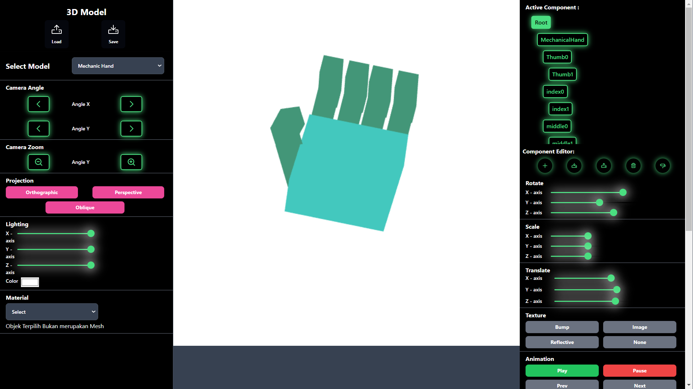

# Tugas Besar IF3260 - Grafika Komputer

> WebGL Part 2: 3D Engine



## Deskripsi Singkat

Repositori ini memuat program _viewer_/_editor_ benda 3D sederhana. Implementasi menggunakan _library_ grafis WebGL dan kakas _front-end_ React.js.

## Cara Menjalankan Program

Lakukan _clone_ repositori ini. Setelah melakukan _clone_, lakukan instalasi _dependency_ dengan perintah berikut.

```
$ npm install
```

Setelah itu, jalankan perintah berikut untuk menghidupkan kakas _front-end_.

```
$ npm run dev
```

## Petunjuk Penggunaan

Petunjuk penggunaan dapat diakses tautan [ini](./manual.md).

## Kontributor

| NIM      | Nama                | Kontribusi Fitur                                                                                             | Kontribusi Model            |
| -------- | ------------------- | ------------------------------------------------------------------------------------------------------------ | --------------------------- |
| 13521043 | Nigel Sahl          | Save and Load, Attribute, Shader Material, Geometry, Mesh, Camera, Orbit Control, Keyboard and Mouse Control | Robot, Hollow Cube          |
| 13521058 | Ghazi Akmal Fauzan  | Animation, Animation Editor, Tweening                                                                        | Animal, Pyramid             |
| 13521065 | Mutawally Nawwar    | UI React.js, Material (Phong), Light, Component Editor                                                       | Creeper, Trapzz             |
| 13521074 | Eugene Yap Jin Quan | Renderer, Types, Util Libraries, Scene Node, Material (Basic), Texture, Vertex Color                         | MechanicalArm, Cinder Block |
