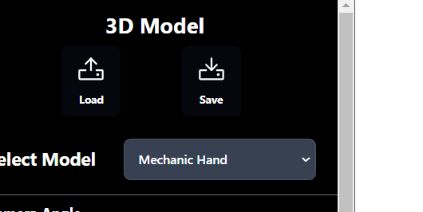

# Petunjuk Penggunaan

<!-- nanti tolong dirapihkan ya gais -->
## Transformasi Objek
1. Untuk melakukan transformasi objek, pengguna bisa memilih objek yang ingin diubah dengan cara klik objek tersebut pada *scene graph*.
2. Setelah objek terpilih, pengguna bisa melakukan transformasi objek dengan cara klik tombol `Translate`, `Rotate`, atau `Scale` pada *Right Bar*.
3. Pengguna juga bisa menggunakan *keyboard shortcut* untuk melakukan transformasi objek. Berikut adalah *keyboard shortcut* yang bisa digunakan:
    - `arrow up` : translasi objek ke atas (sumbu y)
    - `arrow down` : translasi objek ke bawah (sumbu y)
    - `arrow left` : translasi objek ke kiri (sumbu x)
    - `arrow right` : translasi objek ke kanan (sumbu x)
    - `shift` + `arrow up` : translasi objek ke depan (sumbu z)
    - `shift` + `arrow down` : translasi objek ke belakang (sumbu z)

## Kamera
1. Untuk melakukan transformasi kamera, pengguna bisa memilih kamera yang ingin diubah pada Projection di *Left Bar*. (default: Orthographic)
2. Untuk melakukan transformasi kamera atau mengubah angle dan zoom, pengguna bisa mengatur pada bagian Camera Angle dan Camera Zoom di *Left Bar*.
3. Pengguna juga bisa menggunakan mouse. Berikut adalah *mouse control* yang bisa digunakan:
    - `scroll` : zoom in dan zoom out
    - `right click` + `drag` : rotate kamera angle (orbit control)

## TODO

## Save and Load
Fitur save dan load dapat diakses dari sebelah kiri atas tampilan.

- Klik tombol "Save" untuk menyimpan scene yang sedang aktif di layar. Scene yang tersimpan akan disimpan pada lokasi Download di komputer Anda dengan nama file "model.json".

- Klik tombol "Load" untuk membuka scene yang telah tersimpan. Tombol ini akan membuka jendela File Explorer pada komputer Anda untuk memilih file simpanan. Pastikan file yang dibaca bertipe data .json dan merupakan hasil simpanan dari aplikasi ini.

## Animasi

## Light Control
