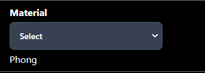

# Petunjuk Penggunaan

## Transformasi Objek

1. Untuk melakukan transformasi objek, pengguna bisa memilih objek yang ingin diubah dengan cara klik objek tersebut pada _scene graph_.
2. Setelah objek terpilih, pengguna bisa melakukan transformasi objek dengan cara klik slider `Translate`, `Rotate`, atau `Scale` pada _Right Bar_.
3. Pengguna juga bisa menggunakan _keyboard shortcut_ untuk melakukan transformasi objek. Berikut adalah _keyboard shortcut_ yang bisa digunakan:
   - `arrow up` : translasi objek ke atas (sumbu y)
   - `arrow down` : translasi objek ke bawah (sumbu y)
   - `arrow left` : translasi objek ke kiri (sumbu x)
   - `arrow right` : translasi objek ke kanan (sumbu x)
   - `shift` + `arrow up` : translasi objek ke depan (sumbu z)
   - `shift` + `arrow down` : translasi objek ke belakang (sumbu z)

## Kamera

1. Untuk melakukan transformasi kamera, pengguna bisa memilih kamera yang ingin diubah pada Projection di _Left Bar_. (default: Orthographic)
2. Untuk melakukan transformasi kamera atau mengubah angle dan zoom, pengguna bisa mengatur pada bagian Camera Angle dan Camera Zoom di _Left Bar_.
3. Pengguna juga bisa menggunakan mouse. Berikut adalah _mouse control_ yang bisa digunakan:
   - `scroll` : zoom in dan zoom out
   - `right click` + `drag` : rotate kamera angle (orbit control)

## TODO

## Save and Load

Fitur save dan load dapat diakses dari sebelah kiri atas tampilan.

- Klik tombol "Save" untuk menyimpan scene yang sedang aktif di layar. Scene yang tersimpan akan disimpan pada lokasi Download di komputer Anda dengan nama file "model.json".

- Klik tombol "Load" untuk membuka scene yang telah tersimpan. Tombol ini akan membuka jendela File Explorer pada komputer Anda untuk memilih file simpanan. Pastikan file yang dibaca bertipe data .json dan merupakan hasil simpanan dari aplikasi ini.

## Select Model

Aplikasi menyediakan beberapa contoh model yang bisa dipilih untuk menggantikan object pada scene. Cara menggantikan model adalah dengan memilih nama model pada dropdown.

## Animasi

1. Untuk mengontrol animasi dari suatu objek, pengguna dapat memilih terlebih dahulu objek mana yang akan dikontrol. Apabila objek tersebut memiliki animasi, maka tool management animasi akan muncul di rightbar, apabila objek tidak memiliki animasi, tool management animasi tidak akan muncul.
2. Pengguna dapat melakukan beberapa aksi pada tool management animasi ini, antara lain:
   - `Play` : Memulai animasi
   - `Pause` : Menghentikan animasi
   - `Previous Frame` : Set frame ke previous frame index
   - `Next Frame` : Set frame ke next frame index
   - `First Frame` : Set frame ke frame index pertama
   - `Last Frame` : Set frame ke frame index terakhir
   - `Apply 30 Tipe Tweening` : Apply mode tweening pada animasi
   - `Reverse` : Set animasi menjadi mode reverse atau mundur
   - `Auto Replay` : Animasi akan memulai dari awal apabila sudah mencapai akhir frame
   - `Set FPS` : Set total frame yang muncul pada setiap detiknya
   - `Select Frame dengan Slider` : Memilih index frame
   - `Edit Animation` : Melakukan pengeditan terhadap animasi dan memunculkan animation editor

3. Pada tool Animation Editor, pengguna dapat melakukan beberapa aksi, antara lain:
   - `Add Frame` : Menambah frame dengan cara mensisipi frame default baru pada frame index yang dipilih.
   - `Delete Frame` : Menghapus frame pada frame index yang dipilih
   - `Swap Next Frame` : Melakukan pertukaran frame antara frame index yang dipilih dengan frame index selanjutnya
   - `Swap Previous Frame` : Melakukan pertukaran frame antara frame index yang dipilih dengan frame index sebelumnya
   - `Add Custom Frame` : Pengguna dapat menyisipkan custom frame pada frame index yang dipilih. Frame yang akan ditambahkan dapat diatur dengan slider pada component editor.
   - `Select Frame dengan Slider` : Memilih index frame
   - `Done` : Untuk kembali ke animation management
4. Animasi dapat disimpan dan load dengan aksi yang terdapat pada component editor. Aksi save dan load pada komponen editor sudah automatis akan menyimpan dan membaca animasi yang sudah diatur pada animation editor. Hal-hal yang akan disimpan berupa model secara keseluruhan bersamaan dengan animasinya (jangan lupa untuk memilih model yang tepat terlebih dahulu sebelum melakukan penyimpanan).

## Light Control

Pengguna dapat mengubah konfigurasi titik cahaya (directional lighting) yang aktif pada scene. Konfigurasi yang dapat diubah adalah posisi sumber cahaya dan warna dari cahaya.

## Switch Material Type

Berdasarkan mesh yang terpilih pada graf "Active Component", pengguna dapat menukar jenis material yang berlaku pada mesh tersebut. Pilihan material adalah _basic material_ dan _phong material_.

## Texture Selection [WIP]

Pengguna dapat memilih jenis tekstur gambar pada mesh yang memiliki material phong. [WIP]

## Component Editor

Berdasarkan object yang terpilih pada graf "Active Component", pengguna dapat melakukan beberapa aksi pada compoenent editor atara lain: 
1. Menambah Child
   Dengan klik tombol plus pada component editor, akan dibuatkan otomatis child dari active object/component berupa cube
2. Save Subtree
   Dengan klik tombol download pada component editor, akan didownload file json dari active object beserta dengan childrennya
3. Menambah Child dari File
   Dengan klik tombol upload, akan diload file json terpilih dan menjadikannya child dari active object
4. Menghapus Object
   Dengan klik tombol sampah, akan dihapus active object beserta childrennya
5. Vertex Color
   Dengan klik tombol kuas dan memilih warna, akan diubah warna pada active object
